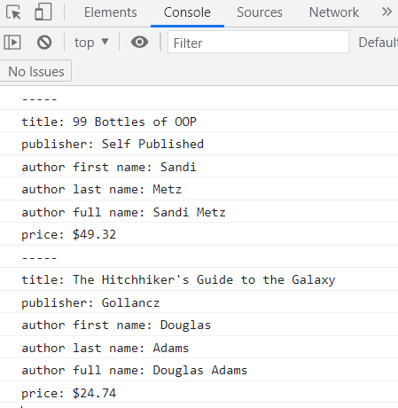
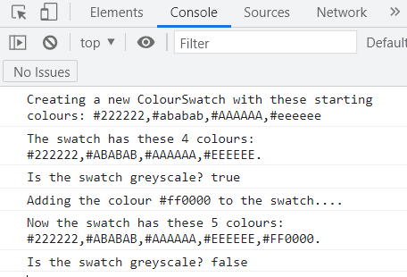

# Tutorial 02: Objects & Functions

**2022-01-17 (M)**

## Overview

This tutorial is meant to give you a feel for how comfortable you are with basic JS syntax, creating and calling JS functions, and creating objects using object literals and constructor functions.


## What things are being checked

[Here are the things](what-things-are-checked.md) being checked in this tutorial.


## How things are being checked

Here is [the script](how-things-are-checked.md) JP will use to gauge your readiness.


## Instructions
   
1. Go to the [GitHub Classroom Links section of the tutorials document](https://github.com/MRU-CSIS-3512-202201-001/shared-course-material/blob/main/tutorials.md#github-classroom-links) in our GitHub Org.
   
2. Click on the correct link to accept the "assignment". 

    _Links won't be active until early (like 4 AM?) on Monday mornings._

3. Clone the accepted repository to your computer.
   
4. Open the resulting local repository in VS Code.

    _You should see a README, folders for two exercises (ex-01 and ex-02), a `package.json` file, and a bunch of "dot files" - files whose names start with a period. The package.json file and dot files will be used in most tutorials and are "plumbing" that you should not change._

5. Run `npm install` in the VS Code terminal to install the tools used by the plumbing.
   
6. Work through the exercises in any order you prefer. Use the appropriate exercise section below to guide you.
   
7. When you feel you are ready for JP to walk through [the marking script](how-things-are-checked.md) with you, DM him on Discord and be prepared to share your screen when he is ready to take a look at your work.

---

## ex-01

### prerequisites

To complete this exercise, you should know how to:

- [ ] create a link to an external JS file in your HTML
- [ ] declare and initialize variables and constants
- [ ] concatenate using `+` or template literals
- [ ] declare and initialize an object literal
- [ ] create a function via a function declaration
- [ ] use MDN as a reference to look up JS documentation

### goal

When the `ex-01/index.html` file is opened in Live Preview and the console is examined, the following should be seen:




### what you'll need to do

1. Create a skeleton html file called `index.html` in the `ex-01` folder. (Emmet makes this easy.)
   
2. Link your `index.html` document to the `index.js` file present in the `ex-01` folder.
   
3. Examine the `index.js` file. In particular, pay close attention to the `displayToConsole` function.
   
4. Complete the TODOs present in `index.js`.


---

## ex-02

### prerequisites

To complete this exercise, you should know how to:

- [ ] create a link to an external JS file in your HTML
- [ ] write output to the console using `console.log()`
- [ ] declare and initialize variables and constants
- [ ] concatenate using `+` or template literals
- [ ] create conditional statements
- [ ] declare and initialize arrays
- [ ] add elements to an array
- [ ] find the length of an array
- [ ] iterate through an array with a `for-of` loop
- [ ] access object properties with dot and/or `[]` notation
- [ ] create a function via a function declaration
- [ ] call functions
- [ ] create a constructor function
- [ ] create an object using a constructor function
- [ ] use MDN as a reference to look up JS documentation

### goal

When the `ex-02/index.html` file is opened in Live Preview and the console is examined, the following should be seen:
 


### about "grey"

To complete this exercise, we'll have to agree on what "grey" means in regards to hex colours. 

We'll say that a given hex colour is **grey** if the R,G, and B components in the colour are all the same.

So #444444 is grey, since R, G, and B are all 44. #efefef is also grey, since its R,G, and B components are all EF.

#0a1313 is not grey, since the only 2 of the 3 components are the same.
 
### what you'll need to do

1. Create a JS file called `index.js` in the `ex-02` folder.
   
2. Link the `index.html` document in the `ex-02` folder to the `index.js` file you created in step 1.
   
3. Create a constructor function called `ColourSwatch`. Here is an example of how an object created from this function should behave:

    ```javascript
    // create a new swatch with 2 starting hex colours
    // notice how the function should take in an array of hex colour strings
    const swatch = new ColourSwatch(['#afafaf', '#222222']);

    swatch.size(); // should return 2, as there are 2 colours in the swatch

    swatch.colourList(); // should return array ['#AFAFAF', '#222222']
    // notice how the original hex colour strings have been capitalized!

    swatch.add('#9e9e9e'); // add a colour to the swatch

    swatch.size(); // should return 3 now

    swatch.colourList(); // ['#AFAFAF', '#222222', '#9E9E9E']
    // notice how the new colour is at the end of the list

    swatch.isGreyscale(); // should return true as each colour in the swatch is "grey"
    ```

    > **_Comments_**  
    > 
    > - _It would be useful (though not necessary) to have a helper method inside your constructor function that determines whether a given hex colour is grey or not._
    > - _Template strings really shine here - they're much less messy than using `+` for concatenation._
    > - _The `size` and `add` methods should be one-liners._

4. Create a constant called `startingColours` that is an array with the following elements:
    
   ```javascript
    "#222222", "#ababab", "#AAAAAA", "#eeeeee"
   ```

5. Create a ColourSwatch object using your constructor function and the `startingolours` array.

6. Use some `console.logs` and the swatch you created to output the desired text to the console. You have to use all the methods in ColourSwatch to do this!
   
---

## Karma
 
- showing up on time gets you some karma (and continuing to do so *consistently* gets you even more)

- if you can complete both exercises successfully, you will get a goodly chunk of karma

- even if you can only get through _some_ of the exercises in time, you'll still get *some* karma

- if you aren't able to complete the exercises in tutorial, but are able to do so before I take a look through everyone's work early Wednesday morning, that will be worth some karma as well

_This wil be the last time I mention this stuff, because it's going to be the same for the rest of the "regular" (i.e. not code quiz) tutorials._

---

## Submitting the tutorial

I will take a look through people's work early (_really_ early!) Wednesday mornings, so if you would like feedback on your code, please make sure you push your work back to your repo before 3 AM on that day.


