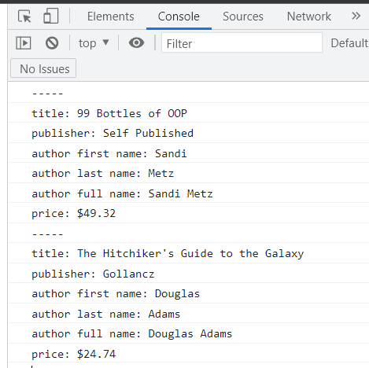

# Tutorial 02: Objects & Functions

**2022-01-17 (M)**

## Overview

Today's tutorial is meant to give you a feel for how comfortable you are working with JS basic syntax, creating and calling JS functions, and the creation of objects (using object literals and constructor functions).

## What things are being checked

[Here are the things](what-things-are-checked.md) being checked in this tutorial.

## Instructions

1. [Look through the script](how-things-are-checked.md) JP will use to gauge your readiness. 
   
2. Go to the [GitHub Classroom Links section of the tutorials document](https://github.com/MRU-CSIS-3512-202201-001/shared-course-material/blob/main/tutorials.md#github-classroom-links) in our GitHub Org.
   
3. Click on the correct (depending on your tutorial time) link to accept the "assignment". 

    _Links won't be active until about 5 minutes before the start of tutorial._

4. Clone the accepted repository to your computer.
   
5. Open the resulting local repository in VS Code.

    _You should see a README, folders for two exercises (ex-01 and ex-02), a `package.json` file, and a bunch of "dot files" - files whose names start with a period. The package.json file and dot files will be used in most tutorials and are "plumbing" that you should not change._

6. Run `npm install` in the VS Code console to install the tools used by the plumbing.
   
7. Work through the exercises in any order you prefer. Use the appropriate exercise section below to guide you.
   
8. When you feel you are ready for JP to walk through [the marking script](how-things-are-checked.md) with you, DM him on Discord and be prepared to share your screen when he is ready to take a look at your work.

---

## ex-01

### prerequisites

- [ ] create a link to an external JS file in your HTML
- [ ] declare and initialize variables and constants
- [ ] concatenate using `+` or template literals
- [ ] declare and initialize an object literal
- [ ] create a function via a function declaration
- [ ] use MDN as a reference to look up JS documentation

### goal

When the `ex-01/index.html` file is opened in Live Preview and the console is examined, the following should be seen:

### what you'll need to do

1. Create a skeleton html file called `index.html` in the `ex-01` folder. (Emmet makes this easy.)
2. Link your `index.html` document to the `index.js` file present in the `ex-01` folder.
3. Examine the `index.js` file. In particular, pay close attention to the `displayToConsole` function.
4. Complete the TODOs present in `index.js`.

---

## ex-01

### prerequisites

- [ ] create a link to an external JS file in your HTML
- [ ] declare and initialize variables and constants
- [ ] concatenate using `+` or template literals
- [ ] declare and initialize an object literal
- [ ] create a function via a function declaration
- [ ] use MDN as a reference to look up JS documentation

### goal

When the `ex-01/index.html` file is opened in Live Preview and the console is examined, the following should be seen:

### what you'll need to do

1. Create a skeleton html file called `index.html` in the `ex-01` folder. (Emmet makes this easy.)
2. Link your `index.html` document to the `index.js` file present in the `ex-01` folder.
3. Examine the `index.js` file. In particular, pay close attention to the `displayToConsole` function.
4. Complete the TODOs present in `index.js`.

## Karma

- showing up on time gets you some karma (and continuing to do so *consistently* gets you even more)

- if you can complete both exercises successfully, you will get a goodly chunk of karma

- even if you can only get through _some_ of the exercises in time, you'll still get *some* karma

_This wil be the last time I mention this stuff, because it's going to be the same for the rest of the "regular" (i.e. not code quiz) tutorials._

---

## Submitting the tutorial

For this first tutorial, there is nothing to submit (though I **do** want to make sure you can push successfully back to GitHub).

## How much do I need to get done to get max karma?

So what exactly am I looking for when I check your progress? Enough work done in 15+ minutes for me to go, "yeah - I think they came reasonably prepared". I might even ask a very simple question or two to confirm my gut feeling.

That's probably not as precise as you might like, but I'm afraid we're dealing with one of those "I know it when I see it" things.

