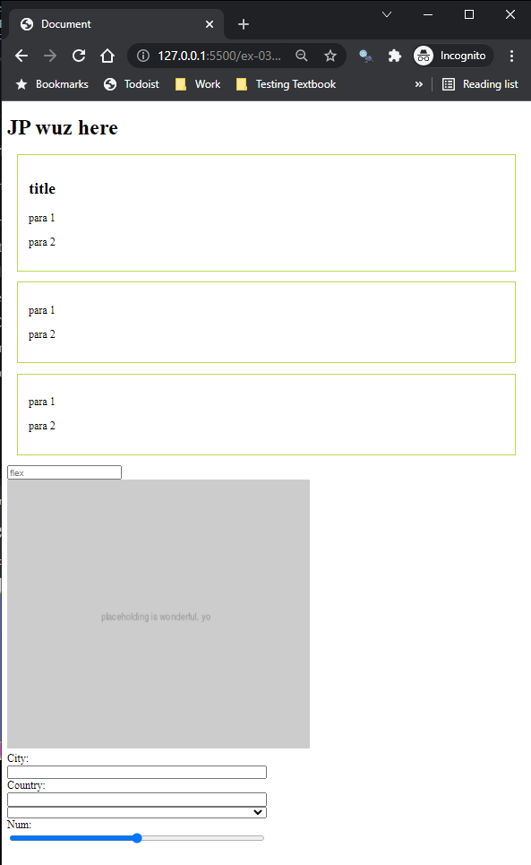

# Tutorial 04: DOM Manipulation

**2022-01-31 (M)**

---

## Overview

This tutorial is meant to get you used to futzing with the DOM: selecting things, altering text, playing with styles, adding elements, and removing them. Roll up your sleeves and gird your loins, not necessarily in that order. 

## Getting a Head Start

Take a look at [this repo](https://github.com/MRU-CSIS-3512-202201-001/tut-04-html) and read that README.

## Instructions
   
1. Go to the [GitHub Classroom Links section of the tutorials document](https://github.com/MRU-CSIS-3512-202201-001/shared-course-material/blob/main/tutorials.md#github-classroom-links) in our GitHub Org.
   
2. Click on the correct link to accept the "assignment". 

    _Links won't be active until early (like 4 AM?) on Monday mornings._

3. Clone the accepted repository to your computer.
   
4. Open the resulting local repository in VS Code.

5. Run `npm install` in the VS Code terminal to install the tools used by the plumbing.
   
6. Work through the exercises in any order you prefer. Use the appropriate exercise section below to guide you.
   
7. When you feel you are ready for JP to look at your work, DM him on Discord and be prepared to share your screen when he is ready.

---

## How Things Look at the Start of Each Exercise

The same page, `index.html` is used for each exercise. It looks like this in the browser:

Your job for each exercise will be to **change how the page looks using only JavaScript - you're not allowed to touch the html or its embedded style sheet at all**. 

Fun!

---

## ex-01

### prerequisites

To complete this exercise, you should know how to:

- [ ] select a DOM element
- [ ] change the text associated with an element
- [ ] apply inline styles to elements
- [ ] add a CSS class to an element
- [ ] add an attribute to an element

### goal

When you're done the steps below, `ex-01/index.html` should look like this:

### what you'll need to do in `ex-01/index.js`

1. Change the text of the `<h2>` to say "This title is bland"
   
2. Change the element with id `specialPara` to have text that is `2em` and `bold`.
   
3. Change the background color of the second `<article>` to `yellow`.
   
4. Change the placeholder in the text input with name `hex` to `#000`.
   
5. Add the `boxy` class to the first div that has the class `box`. Make sure you don't remove the `box` class during this process!

---

## ex-02

### prerequisites

To complete this exercise, you should know how to:

- [ ] select multiple DOM elements
- [ ] change the text associated with an element
- [ ] apply inline styles to elements
- [ ] apply and remove CSS classes from an element

### goal

When you're done the steps below, `ex-02/index.html` should look like this:

 

### what you'll need to do in `ex-02/index.js`

1. Change the text color of all `
` tags that are DIRECT children of `box` class elements to `hotpink`. Also change these same elements' text to say "This is BLUE" (which is a lie, but amusing).

2. Remove the `box` class from everything that has it.
   
2. Add the `strong` and `boxy` classes to every `
` within the first `<article>`. You might want to refresh your memory regarding the `first-of-type` pseudo-class....
   
3. Change the `background colour` of every `text input` to be `rgba(0,0,255,0.1)`
   
---

## ex-03

### prerequisites

To complete this exercise, you should know how to:

- [ ] select one or more DOM elements
- [ ] change the text associated with an element
- [ ] build DOM elements with desired attributes
- [ ] add elements to desired locations in the DOM
- [ ] remove elements from the DOM

### goal

When you're done the steps below, `ex-03/index.html` should look like this:

### what you'll need to do in `ex-03/index.js`

1. Remove the `<button>`.
  
2. Add an `` inside the `<main>` tag - looking at the picture and taking a look at the html, you should be able to figure out where it's supposed to go. The img tag shows the source `https://via.placeholder.com/400x400?text=placeholding+is+wonderful,+yo` and the alt text `"Placehold *this*!"`

    _The size of the image shown in the instructions might be slightly different...I don't have time to go back and fix it, unfortunately!_

3. Add a `<header>` tag with an `<h1>` child that contains the text `(your name) wuz here` as the **first** child of the `<body>`. _Careful - there's nesting going on here!_

---

## Submitting the tutorial

I will take a look through people's work early (_really_ early!) Wednesday mornings, so if you would like feedback on your code, please make sure you push your work back to your repo before 3 AM on that day.

